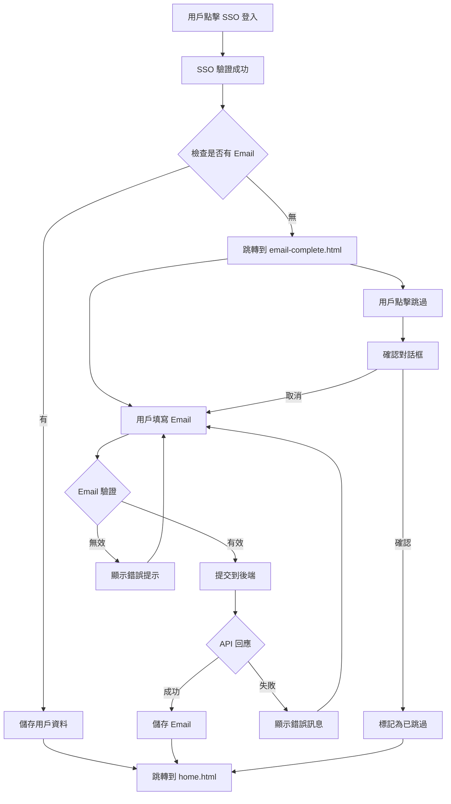

# 📧 Email 補填功能整合指南

## 🎯 功能概述

為了確保在第一版就能「保證拿到用戶的 email」，我們在登入流程中加入了「若無 email，就補填 email」的步驟。

### 流程設計
1. **用戶 SSO 登入** （Google、Facebook、Line、Apple）
2. **系統判斷：有無 email**
   - **有** ➜ 正常進入應用
   - **無** ➜ 導引用戶補填 email（簡單一頁）

## 📁 新增檔案

### 1. `email-complete.html`
Email 補填頁面，包含：
- 符合品牌規範的 UI 設計
- 清晰的說明文字和安全提示
- 即時 email 驗證
- 載入狀態顯示
- 跳過選項（可選）

### 2. `assets/js/pages/email-complete.js`
Email 補填頁面的邏輯處理，包含：
- `EmailCompleteHandler` 類別
- 即時驗證功能
- API 提交邏輯
- 錯誤處理
- 重定向邏輯

### 3. `assets/js/login-flow-integration.js`
登入流程整合檔案，包含：
- SSO 登入後的 email 檢查邏輯
- 各平台 SSO 的處理函數
- 登入狀態檢查工具
- 重定向邏輯

## 🔧 整合方式

### 步驟 1: 在登入頁面加入整合檔案

在 `login.html` 的 `<head>` 區段加入：

```html
<script src="assets/js/login-flow-integration.js" defer></script>
```

### 步驟 2: 修改 SSO 登入回調

將現有的 SSO 登入成功回調修改為調用整合函數：

```javascript
// Google 登入範例
function onGoogleSignIn(googleUser) {
    handleGoogleLogin(googleUser);
}

// Facebook 登入範例
FB.login(function(response) {
    if (response.authResponse) {
        handleFacebookLogin(response);
    }
});

// Line 登入範例 (根據實際 SDK)
liff.login().then(function(lineUser) {
    handleLineLogin(lineUser);
});

// Apple 登入範例
AppleID.auth.signIn().then(function(appleUser) {
    handleAppleLogin(appleUser);
});
```

### 步驟 3: 在其他頁面加入登入狀態檢查

在需要確保用戶已登入且完成 email 設定的頁面（如 `home.html`、`settings.html` 等）加入：

```html
<script src="assets/js/login-flow-integration.js" defer></script>
<script>
document.addEventListener('DOMContentLoaded', function() {
    checkLoginStatus();
});
</script>
```

## 🎨 設計特色

### 視覺設計
- **品牌一致性**：使用 AqiveLife 的品牌色彩 `#FF9D4D` 和 `#E57254`
- **iOS 風格**：採用現代 iOS 設計語言
- **毛玻璃效果**：內容卡片使用 `backdrop-filter: blur(10px)`
- **漸層背景**：品牌色彩的線性漸層

### 互動體驗
- **即時驗證**：輸入時即時檢查 email 格式
- **視覺回饋**：綠色邊框表示有效，紅色表示無效
- **載入狀態**：提交時顯示旋轉載入動畫
- **錯誤處理**：網路錯誤時顯示友善提示

### 安全考量
- **隱私說明**：明確告知用戶 email 的使用目的
- **安全提示**：保證不會用於垃圾郵件
- **跳過選項**：允許用戶稍後設定（但會有提醒）

## 📊 資料流程



## 💾 本地儲存管理

系統使用 `localStorage` 來管理用戶狀態：

```javascript
// Email 相關狀態
localStorage.setItem('user_email', email);              // 用戶 email
localStorage.setItem('email_completed', 'true');        // 是否已完成 email 設定
localStorage.setItem('email_skipped', 'true');          // 是否已跳過 email 設定
localStorage.setItem('email_completion_time', iso_date); // 完成時間
localStorage.setItem('email_skip_time', iso_date);       // 跳過時間

// 用戶相關資料
localStorage.setItem('user_data', JSON.stringify(data)); // 用戶基本資料
localStorage.setItem('login_time', iso_date);            // 登入時間
```

## 🔄 重定向邏輯

### URL 參數
- `redirect`: 完成後要跳轉的頁面
- `email`: 預填的 email（如果 SSO 有提供部分資料）

### 範例 URL
```
email-complete.html?redirect=home.html&email=user%40example.com
```

## ⚙️ 後端整合

### API 端點需求

1. **儲存 Email**
   ```
   POST /api/user/email
   Body: { email: "user@example.com" }
   Response: { success: true, message: "Email saved" }
   ```

2. **檢查 Email 狀態**
   ```
   GET /api/user/email-status
   Response: { hasEmail: true, email: "user@example.com" }
   ```

### 修改建議

在 `email-complete.js` 的 `submitEmail` 方法中，將模擬 API 請求替換為真實的 API 調用：

```javascript
async submitEmail(email) {
    const response = await fetch('/api/user/email', {
        method: 'POST',
        headers: {
            'Content-Type': 'application/json',
            'Authorization': `Bearer ${getUserToken()}`
        },
        body: JSON.stringify({ email })
    });
    
    if (!response.ok) {
        throw new Error('儲存 Email 失敗，請稍後再試');
    }
    
    return response.json();
}
```

## 🧪 測試建議

### 手動測試情境
1. **有 Email 的 SSO 登入**：應直接進入主頁
2. **無 Email 的 SSO 登入**：應跳轉到補填頁面
3. **Email 格式驗證**：測試各種有效/無效格式
4. **網路錯誤**：模擬 API 失敗情況
5. **跳過功能**：測試跳過後的行為
6. **重定向**：測試不同來源頁面的重定向

### 自動化測試
可以考慮加入單元測試來驗證：
- Email 格式驗證函數
- 本地儲存邏輯
- 重定向邏輯
- 錯誤處理

## 📈 改進建議

### 短期優化
1. **多語言支援**：加入英文等其他語言版本
2. **更多驗證**：加入 email 域名白名單/黑名單
3. **統計追蹤**：記錄跳過率等數據

### 長期規劃
1. **Email 驗證**：發送驗證信件確認 email 有效性
2. **智能提醒**：對跳過的用戶定期提醒補填
3. **社交登入增強**：嘗試從更多管道獲取 email

## 🆘 常見問題

### Q: 用戶可以跳過 email 設定嗎？
A: 可以，但會有明確的警告和後續提醒機制。

### Q: 如何處理用戶輸入無效的 email？
A: 系統會即時驗證並顯示錯誤提示，不允許提交無效格式。

### Q: 如果用戶關閉瀏覽器後重新進入會怎樣？
A: 系統會檢查本地儲存狀態，未完成的用戶仍會被導引到補填頁面。

### Q: 如何確保不會重複要求已完成用戶補填 email？
A: 系統使用 `localStorage` 記錄完成狀態，並在每次登入時檢查。

---

💡 **提示**：這個功能設計考慮了用戶體驗和數據收集的平衡，既能保證獲得 email，又不會過於強制，維護了良好的用戶關係。 